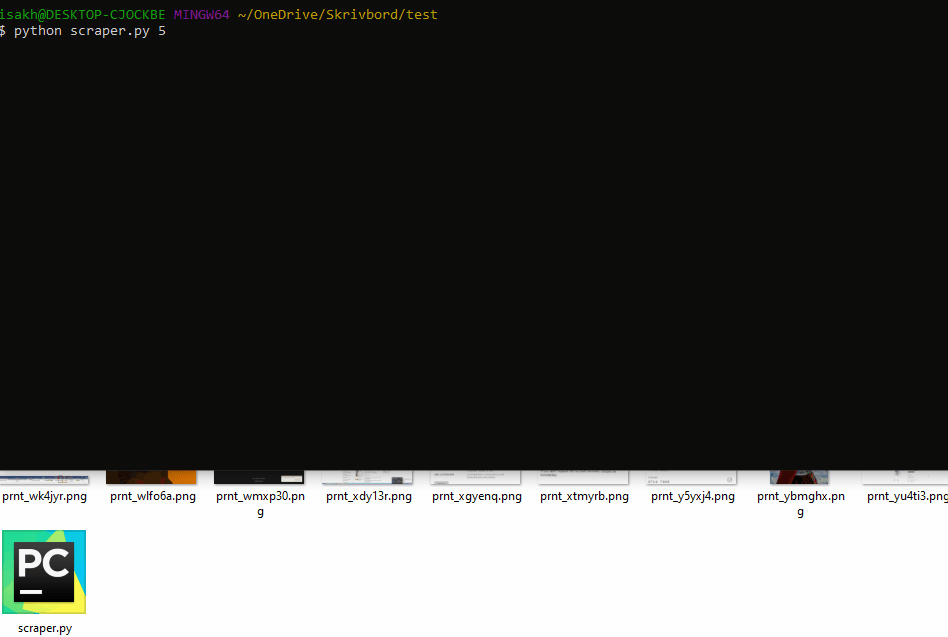

# scraper :computer:
prnt.sc is a website for hosting screenshots taken with Lightshot. Since the url ids are not random you could easily run through every url and download the picture and that is exactly what this script does

:heavy_exclamation_mark: I do not take any responsibility for people using this script in harmful ways. I am working on this project for fun & to learn. I recommend using some sort of image recognition ai to detect sensitive content such as bank details and pornography because you probably do not want to save that to disk since it's illegal :heavy_exclamation_mark:

### how to set up project :file_folder:

```
1) download this repo
2) install lxml with for example pip, like this: "pip install lxml"
```

### how to use :question:

```
python scraper.py [amount_of_images]
```


### features :heavy_check_mark:
* duplicate screenshots detection & removal
* decimal to base 36 conversion
* scraping

### todo :clipboard:
* multithreading

### ideas :bulb:
* multithreading
* proxies
* detect gifs
* GUI
* better project structure

### bugs & cons :warning:
* duplicate detection sometimes miss some duplicates
* slow (:no_entry: critical)

### contributions :trophy:
* you could be on this list

### inspiration :recycle:
* @sixtrains at Tiktok who inspired me to make this project

### communication :speech_balloon:
:email: if you have any questions feel free to mail me at isakhorvath@gmail.com

:beers: know how to improve the code? feel free to send a pull request! open for collaboration

:headphones: wanna hang out, talk about programming or work on a project? add me on discord: tavro#9198

:coffee: feeling generous? buy me a coffe https://www.buymeacoffee.com/CvaPyAznK

:star: if you found this useful or interesting I would appreciate a star 
